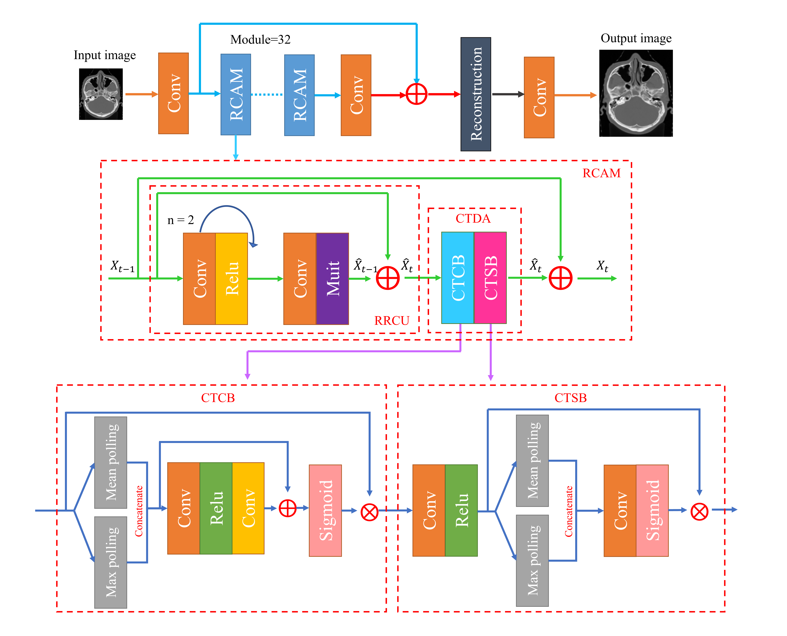

[](https://www.python.org/downloads/release/python-380/)

</a>

# CDAN
This is the official PyTorch implementation of the CDAN super-resolution reconstruction algorithm using the recurrent dual attention mechanism from "Cyclic Residual Convolutional Neural Network based on Dual Attention Mechanism
(CDAN) for CT Image Super-Resolution" (Yanhua Liu, Xiangchen Li, Min Liu, Feng Yang, Hongjuan Yang, 2023).

The novel approach is comprised of 32 recurrent convolution unit to learn the sophisticated mapping of CT images from ”Low-” to ”High-” resolution and use the attentional mechanism module with residual structure to capture the channel information in the feature map.



# Test:

**The pretrained models and test codes are uploaded, now you can run `test.py` to get results in the paper.**

# Parameters:
- `train_path`: Select the training data path.
- `val_path`: Select the validation data path.
- `batch_size`: Select the batch size of network for the training phase. Default to 30.
- `workers`: Select the number of PyTorch data loader workers. Default to 32.
- `crop_size_train`: Select the number of cross validation folds.
- `crop_size_val`: Select the number of cross validation folds.  
- `net_scale`: Select a randomly cropped batch size for the training phase.  Default to 128.
- `checkpoint`: Select a randomly cropped batch size for the validation phase. Default to 128.
- `epochs`: Select the maximum number of epochs to train. Default to 300.
- `model`: Select the super-resolution reconstruction model - one of ['CDAN', 'ESRT', 'FENet', 'FSRCNN', 'LapSRN', 'RFDN', 'SRResNet', 'VDSR'] Default to 'CDAN'.
- `lr`: Selelct the initial (base) learning rate. Default to 0.001.
- `lr-gamma`: Select the gamma parameter of exponential learning rate decay. Default to 0.95.
- `device`: Select the GPU to use. Default to cuda:0.
- `logdir`: Select a folder to save training and validation logs to.

# Start Training
Ensure all requirements from the `Parameters` are met.

To start training, run `train.py`. The results will be logged into the `log` directory.

# Example

This is an example file for training a `CDAN` model in 4× enlargement:

```yml
train_path: <path-to-train_set>
val_path: <path-to-val_set>
batch_size: 30
crop_size_train: 128
crop_size_val: 128
net_scale: 4
checkpoint: r'params/CDAN_x4.pth'
model: 'CDAN'
start_epoch: 1
epochs: 300
workers: 32
ngpu: 1
cudnn.benchmark: True
lr: 1e-4
lr-gamma: 0.95
lr-step: 5
log_dir: <foler-to-log-to>
device: torch.device("cuda:0")
```

